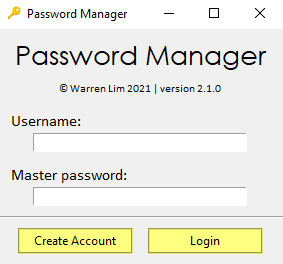
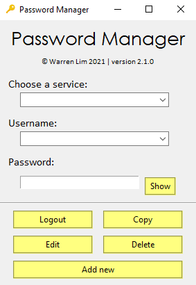

# PassMan
 PassMan is a simple password manager that encrypts and stores passwords. It has a login system with mutiple account support, and has simple interface that allows users to add, delete, or alter stored passwords.

 Compiled with `pyinstaller --onedir -w -i img\keyicon.ico passwordManager.py`

#### Login Screen
  

#### Main Screen
 

## Dependencies
 - cryptography (pip install cryptography)

## Disclaimer
  
This password manager was created as fun project to learn about encryption and GUIs, and is not meant to provide high end security for storing passwords. Storing important passwords and other sensitive data in this application is **NOT** recommended.

## Installation
The installer for the newest release can be downloaded from the [releases](https://github.com/wrrnlim/PassMan/releases) page (the exe file). You can also run PassMan via source code, which requires dependencies installed on your machine.
